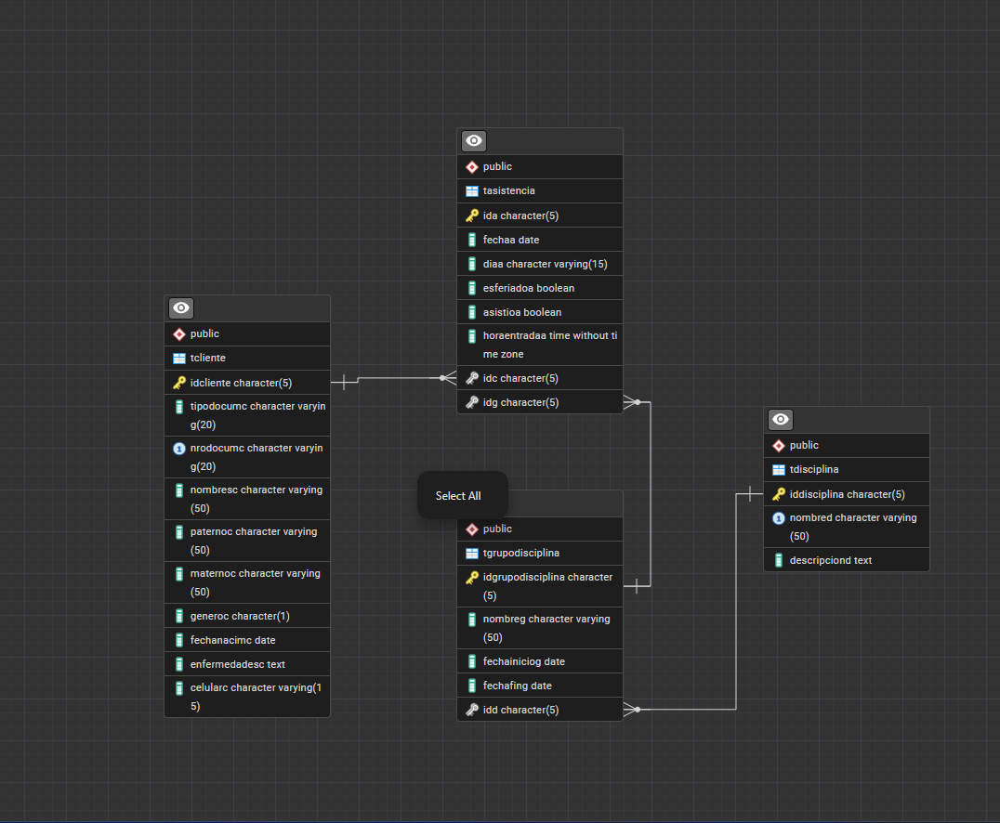

#Taller 1.2 : Implementación de Modelos Físicos

---

## Actividad 8: Gimnasio Titanium
En esta actividad transformamos un modelo Entidad-Relación a un modelo físico en PostgreSQL usando claves foráneas y restricciones.

### Diagrama Físico


### Código SQL (Implementación)
```sql
-- Aquí pegas el código SQL que hicimos juntos
-- 1. Tabla Cliente
CREATE TABLE TCliente
(
    IdCliente CHAR(5) PRIMARY KEY, 
    tipoDocumC VARCHAR(20),
    nroDocumC VARCHAR(20) UNIQUE NOT NULL, 
    nombresC VARCHAR(50) NOT NULL,  
    paternoC VARCHAR(50) NOT NULL, 
    maternoC VARCHAR(50),
    generoC CHAR(1),
    fechaNacimC DATE,
    enfermedadesC TEXT, 
    celularC VARCHAR(15)
);

-- 2. Tabla Disciplina
CREATE TABLE TDisciplina
(
    IdDisciplina CHAR(5) PRIMARY KEY,
    nombreD VARCHAR(50) UNIQUE NOT NULL,  
    descripcionD TEXT
);

-- 3. Tabla GrupoDisciplina
CREATE TABLE TGrupoDisciplina
(
    IdGrupoDisciplina CHAR(5) PRIMARY KEY,
    nombreG VARCHAR(50) NOT NULL,          
    fechaInicioG DATE,
    fechaFinG DATE,
    idD CHAR(5) NOT NULL,                 
    -- CORRECCIÓN: Un grupo pertenece a una disciplina
    FOREIGN KEY(idD) REFERENCES TDisciplina(IdDisciplina)
);

-- 4. Tabla Asistencia
CREATE TABLE TAsistencia
(
    idA CHAR(5) PRIMARY KEY,
    fechaA DATE NOT NULL,                  
    diaA VARCHAR(15),
    esferiadoA BOOLEAN,
    asistioA BOOLEAN,
    horaEntradaA TIME,
    idC CHAR(5) NOT NULL,                 
    idG CHAR(5) NOT NULL,                 
    -- CORRECCIÓN: (Columna local) REFERENCES TablaDestino(ColumnaDestino)
    FOREIGN KEY(idC) REFERENCES TCliente(IdCliente),
    FOREIGN KEY(idG) REFERENCES TGrupoDisciplina(IdGrupoDisciplina)
);
